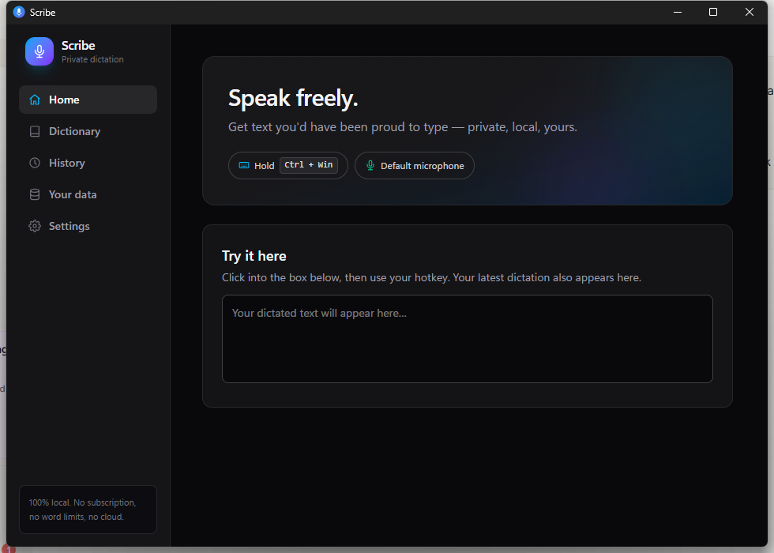

# Scribe

**Speak freely; get text you'd have been proud to type.** A free, private, local-first voice-dictation utility — a Wispr Flow you own. No subscription, no word caps, no cloud.

*Windows-first (macOS/Linux untested) · MIT licensed · 100% local by default*



Hold your hotkey and a small overlay shows it listening:


Hold **Right Ctrl**, talk (even for minutes), release — clean, professionally formatted text lands at your cursor in any app: filler words removed, grammar fixed, spoken lists turned into real lists that end when you go back to talking normally.

```
You say:   "um so for the party I need one balloons two a chocolate cake
            three birthday candles and uh after that we can basically just relax"

You get:   For the party I need:
           1. Balloons
           2. A chocolate cake
           3. Birthday candles

           And then we can just relax.
```

## How it works
Two-stage local pipeline, nothing leaves your machine:
1. **whisper.cpp** (GPU/CUDA if available) turns speech into a raw transcript — biased toward your personal dictionary words.
2. **A small local LLM** (qwen3:4b-instruct via Ollama) rewrites it like a careful human editor, following a strict contract (never invent, remove disfluencies, honor spoken punctuation, detect and terminate lists, apply your writing style).

## Install (easiest)
Download **Scribe Setup (.exe)** from the [Releases page](../../releases), run it, and follow the in-app setup checklist. To build from source instead, see below.

## Features
- **Push-to-talk** (hold Right Ctrl by default — rebind to any key or combo in Settings, applied instantly) or toggle hotkey; types into any app via clipboard-safe paste injection
- **Microphone picker** — choose exactly which mic Scribe listens to
- **Personal dictionary with shorthands** — teach invented words once; say a shorthand ("ToF") and get the full phrase ("Tide of Fortune"); corrections you make in History are learned automatically
- **Writing styles** — Professional / Casual / Messaging
- **History** (local, optional, deletable) with re-copy and fix-a-word learning
- **Phone dictation** — opt-in LAN bridge: your phone records, your PC's models clean, nothing touches the internet (detects and explains Windows Firewall blocks)
- **Your Data page** — see everything Scribe knows about you in a readable view organized on-device by the local model, or as raw read-only JSON
- **Cloud (opt-in only, BYOK)** — optional Groq/Gemini cleanup with your own free key; text-only, visible notice every use
- **Auto-tiering** — first-run benchmark picks the right models for the machine
- **Privacy** — default 100% offline; one-click delete-all-data; zero telemetry

## Getting started (from source)
Prerequisites: **Node.js 20+**. For the cleanup stage, install [Ollama](https://ollama.com) and pull the model:
```bash
ollama pull qwen3:4b-instruct   # NOT plain qwen3:4b — the thinking variant is ~40x slower here
```
Then:
```bash
npm install          # postinstall fetches the Electron-ABI sqlite prebuild
npm run dev          # start the app
```
On first run the in-app setup checklist walks you through mic permission and downloading the speech engine + model. The speech engine is [whisper.cpp](https://github.com/ggml-org/whisper.cpp) prebuilt binaries — download a release zip (CUDA build for NVIDIA GPUs, or the CPU build) and extract it to `resources/whisper/cuda/` or `resources/whisper/cpu/`. Speech models (`ggml-base.en.bin`, `ggml-small.en.bin`) can be downloaded from the setup checklist, or manually from [Hugging Face](https://huggingface.co/ggerganov/whisper.cpp) into `models/`.

## Development
```bash
npm test             # offline suite (fixtures, corrections, sanitizers, combo tracking)
npm run test:live    # cleanup contract against the real local model (needs Ollama)
npm run typecheck    # strict TS, no any
npm run package      # Windows NSIS installer -> release/
```

## License
MIT — see [LICENSE](LICENSE).

Docs: [BUILD-SPEC](docs/BUILD-SPEC.md) · [EXECUTION-PLAN](docs/EXECUTION-PLAN.md) · [DECISIONS](docs/DECISIONS.md) · [SCORECARD](docs/SCORECARD.md)
